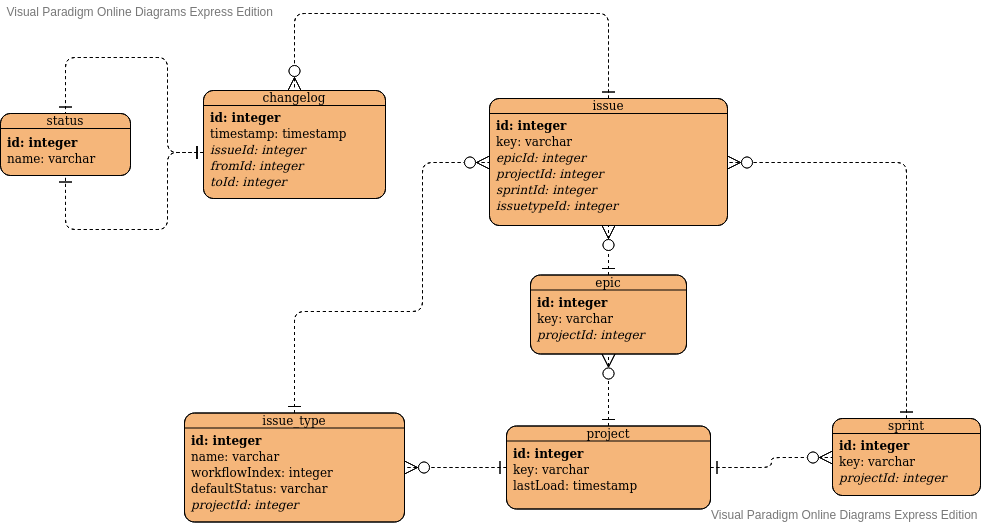

# Jira Report App

## Set up Environment
* Set up environment variables for connection in a .env file

```
export JIRA_BASIC_AUTH_TOKEN="Basic {AuthToken}"
export JIRA_ENDPOINT="{Jira Service URL}"
export JIRA_PRODUCT="{Jira Software|Jira Server}"
```

# Version and dependencies

* install node version using a node version manager like nvm
```bash
brew install nvm
nvm install 10.16.0
```

* Install dependencies
```bash
npm install
```

# Database

* This app uses TypeORM for handling of databases, set up your database configuration on the file 
ormconfig.json like the following example.
```json
{
   "type": "postgres",
   "host": "localhost",
   "port": 5432,
   "username": "postgres",
   "password": "docker",
   "database": "postgres",
   "synchronize": true,
   "logging": false,
   "entities": [
      "src/apps/core/entity/**/*.ts"
   ],
   "migrations": [
      "src/apps/core/migration/**/*.ts"
   ],
   "subscribers": [
      "src/subscriber/**/*.ts"
   ],
   "cli": {
      "entitiesDir": "src/entity",
      "migrationsDir": "src/migration",
      "subscribersDir": "src/subscriber"
   }
}
```
* The App makes use of a raw SQL query on ./src/apps/core/sql/status/sql-function-status.ts, update
the query format in case of use of a database other than PostgreSQL
## Docker usage
```bash
docker build -t [app-name] .
docker run -p 3000:3000 [app-name]
```

## Run test
```bash
npm run test
```

## execute
```bash
npm run start:dev
```

## build
```bash
npm run build
```

# Load Data
* Use the load projects route to load every project in the jira instance into the database
```http request
https://{your-url}/jira/load/projects
```
* To upload all the data from a single project (Issues,changelog,etc.) use the single project load
url AFTER loading all the projects
```http request
https://{your-url}/jira/load/project/{projectKey}
```
# API Docs
* Access the API Docs of the app by using this route
```http request
https://{your-url}/docs
```
